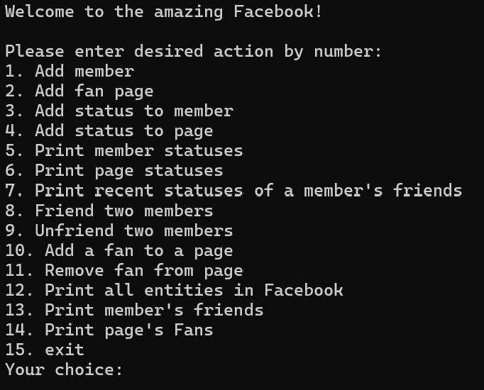
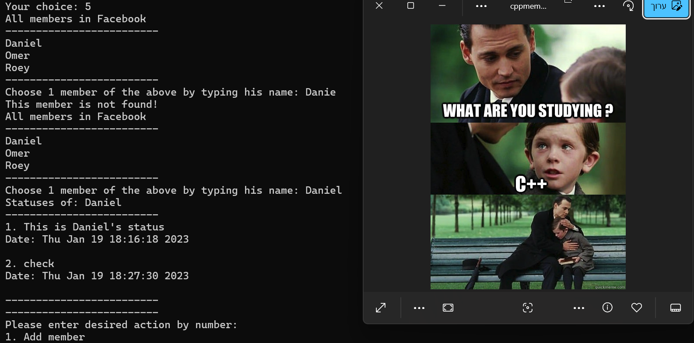

# Social Media App

## Overview
A console-based social media application implemented in C++ with an emphasis on Object-Oriented Programming (OOP). The application allows users to interact, add statuses, manage friendships, and follow fan pages. All data is saved to a text file.

## Features
### User and Page Management
- Add a new member
- Add a fan page

### Status Updates
- Add a status to a member
- Add a status to a fan page
- Print a member's statuses
- Print a fan page's statuses
- Print recent statuses of a member's friends

### Social Interactions
- Friend two members
- Unfriend two members
- Add a fan to a page
- Remove a fan from a page

### Data Overview
- Print all entities in the application
- Print a member's friends
- Print a fan page's fans

### Exit
- Exit the application

## Usage
Users can interact with the application through a numbered menu system. Simply enter the corresponding number to perform an action.

## Example

